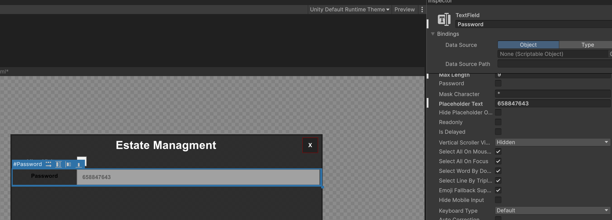
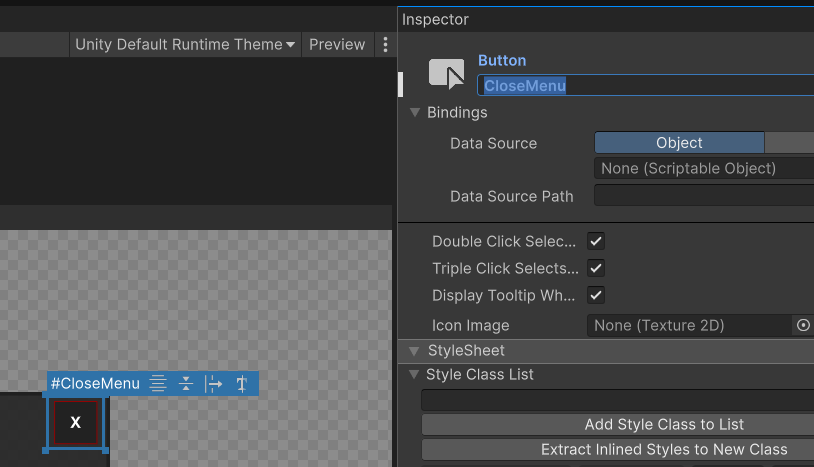
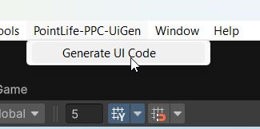
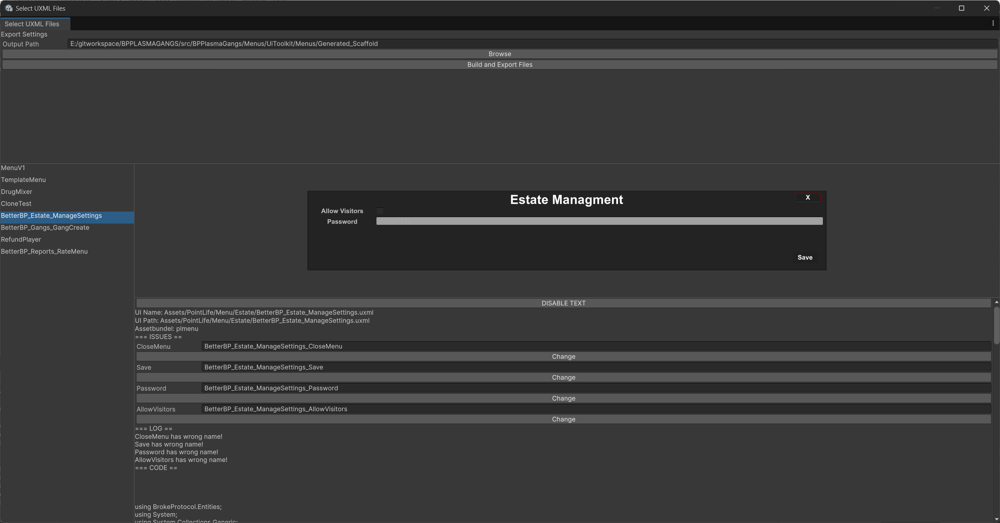
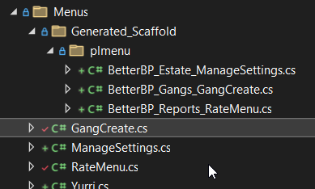
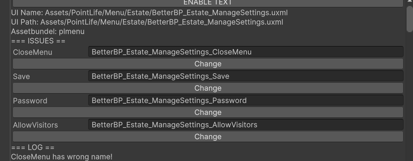
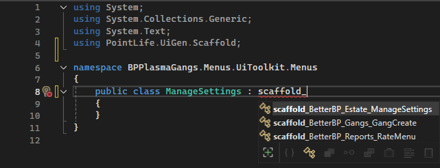
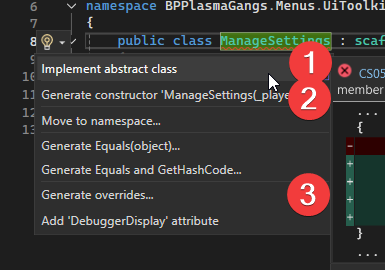
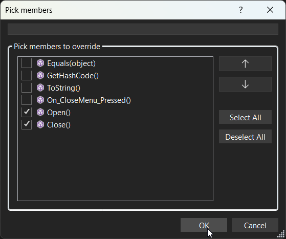

## Why use UiGen?
- Cleaner Code
- Less Work
- No Need of Wondering why it doesnt work because in Code you had "EnterButton" and in Unity you had "Enterbutton".
- No Risk of transfer Error between Unity and C#.

## 📌 Currently Supported Elements
[Currently Supported Elements](CurrentlySupportedElements.md)

1. **Import unitypackage**  
   [PL_PPC_UiGen.unitypackage](PL_PPC_UiGen.unitypackage)

2. **Wait for Unity to Recompile**

3. **`.uxml` File Naming Convention**  
   Files must be named in the format `[PluginName]_[Category/Folder]_[MenuName]`, e.g.:
   ```
   BetterBP_Estate_ManageSettings.uxml
   ```
   This helps avoid name conflicts between menus or plugins.

4. **UI Object Names**  
   Set each UI object's name that you want to have a variable.  
   

5. **Close Button Requirement**  
   If you want a close button, it **must** be named `"CloseMenu"`.  
   
   This will generate a `virtual void On_CloseMenu_Pressed` with `this.Close()` instead of a `abstract void` which will need to be manually overwritten.

7. **Generate UI Code**  
   Navigate to `PointLife-PPC-UiGen` → `Generate UI Code`  
     
   

8. **Select the Export Path**  
   Create a folder in your Visual Studio solution for your plugin.
   Ideally the Autogenerated Stuff has its own Folder so it does not overwrite or delete any of your code.
   

10. **Enable `DISABLE TEXT`**  
   This will show the names of the fields. This does not change anything and is just information for you to see if everything is named correctly.

11. **Accept or Modify Suggested Fixes**  
   Address the proposed changes to resolve any issues. The Field and File naming is that two Menus won't be sending the same Event.
   Example the CloseButton would otherwise falsely trigger for all Menus if not renamed.
   

12. **Build and Export Files**

13. **Add DLL Reference**  
   Add `!0PPC-UiGen-BaseType.dll` as a reference in your plugin and place it in the `Plugins` or `Managed` folder.  
    [!0PPC-UiGen-BaseType.dll](%210PPC-UiGen-BaseType.dll)

   ```xml
   <Reference Include="0PPC-UiGen-BaseType">
       <HintPath>$(BPDIR)\Plugins\!0PPC-UiGen-BaseType.dll</HintPath>
   </Reference>
   ```

12. **SDK-style `.csproj` Support**  
   If you're using an SDK-style `.csproj`, the exported folder will be included automatically.

13. **Scaffold a New Class**  
   Create a class and add:

   ```csharp
   using PointLife.UiGen.Scaffold;
   ```

   Inherit from `scaffold_`.  
   

14. **Use Visual Studio Alt+Enter**  
   To auto-generate the class.  
     
   You can override `Open` and `Close` if needed.
   Note: Instead of setting stuff in Open ideally set it in the Constructor.
   

You can now add Code
 ```cs
using BPEssentials.ExtensionMethods;
using BrokeProtocol.Entities;
using PointLife.UiGen.Scaffold;

namespace BPPlasmaGangs.Menus.UiToolkit.Menus
{
	public class ManageSettings : scaffold_BetterBP_Estate_ManageSettings
	{
		public ManageSettings(ShPlayer _player) : base(_player)
		{
		}

		public override void Open()
		{
			Fields.Text_Password.UpdateTo("123456789");     // Write last Password
			Fields.Toggle_AllowVisitors.UpdateTo(true);     // Write last Toggle

			base.Open();
		}

		public override void On_Save_Pressed()
		{
			Fields.UpdateAll(player).Then(() =>             // Get all Fields from the Client
			{
				player.TS("settings_saved");

				player.TS("setting_toggle", Fields.Toggle_AllowVisitors.CheckboxValue);
				player.TS("setting_password", Fields.Text_Password.Text);

				Close();    // Close Menu
			});
		}
	}
}

```

In a Command it can then be used like:
```cs
new ManageSettings(player).Open();
```

